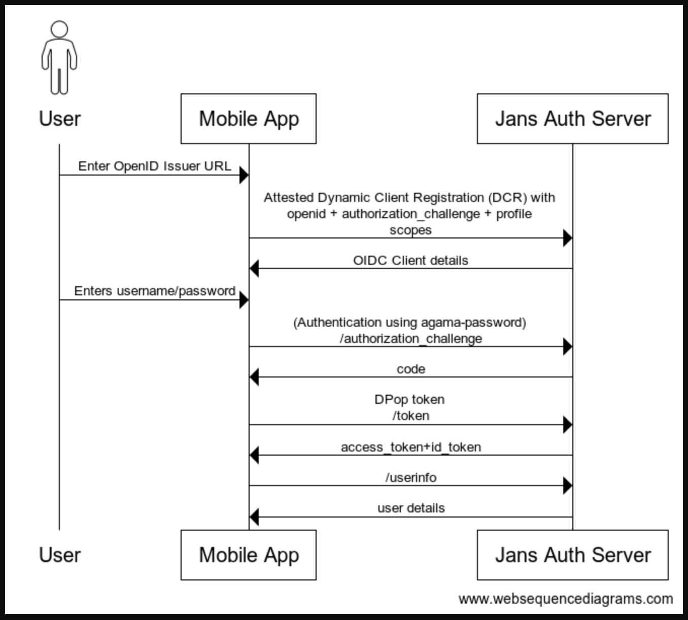

## Jans Chip

This is a Kotlin Multiplatform (KMP) mobile application for Android and iOS that demonstrates a complete OpenID Connect (OIDC) authentication flow using dynamic discovery and client registration. We are using Agama Native to manage authentication flow.

### Steps to Run the app:

1. Deploy [agama-pw](https://github.com/GluuFederation/agama-pw) project on Jans auth server.
2. Run on Android : Open the app on Android Studio and run it.
3. Run on iOS : Open janschip/iosApp on xcode.

### Sequence diagram

### Task pending:

1. Implement attested of DCR.
2. Use Dpop token
3. Use agama-passkey
